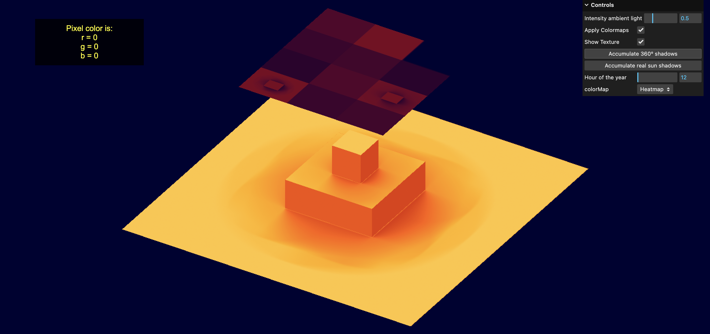

# 🌞 Irradiance Three.js

This project focuses on developing a system to **calculate and visualize 3D irradiance maps** using **Three.js** and **JavaScript**, supported by research on photovoltaic technologies.

---

## 🚀 Setup

Make sure you have [Node.js](https://nodejs.org/) installed, then run the following commands:

```bash
# Install dependencies (only the first time)
npm install

# Run the local development server (default: http://localhost:8080)
npm run dev

# Build for production (output in the dist/ directory)
npm run build
```

📸 App Preview

Below is an example of the Irradiance application in action.


